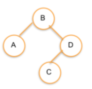

Binary Node Add
---

## Challenge

Implement the add method for this `BinaryTreeNode` class:

```js
class BinaryTreeNode {
  constructor(value) {
    this.value = value;
    this.left = null;
    this.right = null;
  }

  }

class BinaryTree {
  constructor(value) {
    this.root = new BinaryTreeNode(value);
  }
  add(node) {
    // Implement me!
    // We want to set current to our root which is defined above
    let current = this.root;
    // check if new node is greater than or less than current value
    if(node.value >= current.value) {
      // if greater than, new node goes to the right
        // Check if current.right exists
        
          // If it exists
          current = current.right;
          // If it doesn't exist
          current.right = new BinaryTreeNode(node);
    }

      // if less than, new node goes to the left
        
  }
}


```

Keep in mind this is a recursive operation.

## Test Cases

```js
const B = new BinaryTreeNode('B');
const A = new BinaryTreeNode('A');
const C = new BinaryTreeNode('C');
const D = new BinaryTreeNode('D');

// B will be the root of the tree:
B.add(A);
B.add(D);
B.add(C);
```



## Note

FYI: the shape of a Binary Tree is dependant on order of construction.

